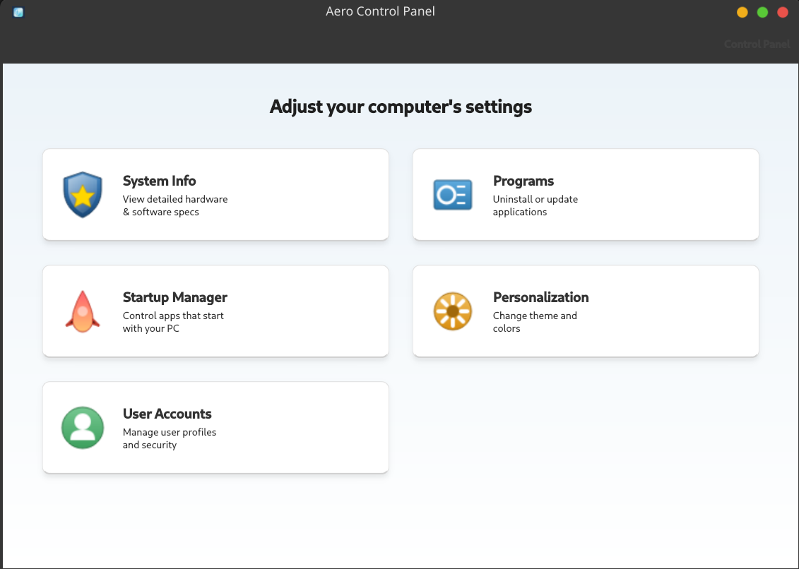

# Aero Control Panel - Installation Guide



Aero Control Panel is a modern, Qt-based system configuration tool for Linux, featuring a glassmorphic design and comprehensive system management capabilities.

## Prerequisites

Ensure you have the following dependencies installed:

-   **Qt 6** (Widgets, Core, Gui)
-   **CMake** (3.16+)
-   **C++ Compiler** (GCC/Clang, C++17 support)
-   **Ninja** or **Make**
-   **pkexec** (for privileged operations)

### Ubuntu / Debian
```bash
sudo apt install build-essential cmake qt6-base-dev qt6-base-private-dev libqt6widgets6 libqt6gui6 libqt6core6 ninja-build
```

### Arch Linux
```bash
sudo pacman -S base-devel cmake qt6-base ninja
```

---

## 📦 Installation Methods

### 1. Debian / Ubuntu (.deb)

If you have downloaded the `.deb` package:

```bash
sudo apt install ./aero-control-panel-1.0.0-Linux.deb
```

To build the `.deb` package yourself:

```bash
mkdir build && cd build
cmake ..
make package
# The .deb file will be generated in the build directory
```

### 2. Arch Linux (PKGBUILD)

We provide a standard `PKGBUILD` for Arch Users.

```bash
makepkg -si
```

### 3. Manual Installation (Universal)

You can build and install manually on any distribution:

```bash
# 1. Build
mkdir build && cd build
cmake ..
make -j$(nproc)

# 2. Install (requires sudo)
cd ..
./install.sh
```

---

## 🚀 Running the Application

Once installed, you can launch the application from your desktop menu by searching for **Aero Control Panel** or running:

```bash
aero_panel_cpp
```

## 🛠️ Uninstallation

If installed via manual script:
```bash
sudo rm /usr/bin/aero_panel_cpp
sudo rm /usr/share/applications/aero_panel_cpp.desktop
sudo rm /usr/share/icons/hicolor/128x128/apps/aero_panel_cpp.png
```

If installed via Package Manager (`apt` / `pacman`), simply remove the package:
```bash
sudo apt remove aero-control-panel
# or
sudo pacman -R aero-control-panel
```
